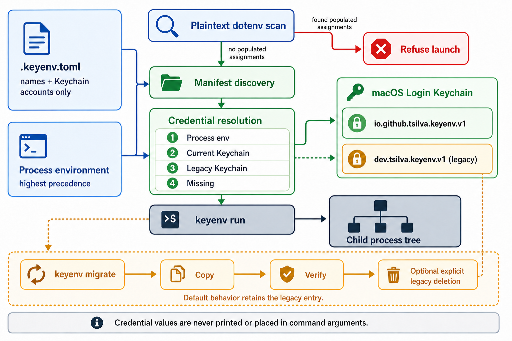

# keyenv

`keyenv` is a macOS command-line tool for developers who want local credentials
out of plaintext dotenv files. It stores values in the login Keychain and adds
them only to commands launched explicitly through `keyenv run`.

Applications keep using their normal environment APIs: Python reads
`os.environ`, Node.js reads `process.env`, and child processes inherit the
resolved environment. Credential values are never printed or placed in command
arguments.

## Install

`keyenv` requires macOS and Python 3.11 or newer.

```bash
uv tool install keyenv-macos
keyenv --help
```

The distribution is named `keyenv-macos`; the installed command is `keyenv`.

## Configure

Commit a value-free `.keyenv.toml` at the root of each project:

```toml
[keyenv]
version = 1

[secrets.OPENROUTER_API_KEY]
account = "my-project/OPENROUTER_API_KEY"
required = true
```

Environment names must be uppercase shell identifiers. Public browser and
mobile prefixes such as `NEXT_PUBLIC_`, `VITE_`, and `EXPO_PUBLIC_` cannot be
declared as secrets. Keychain accounts must be unique within a manifest.

Store each credential through the hidden interactive prompt:

```bash
keyenv set OPENROUTER_API_KEY
keyenv doctor
```

## Commands

```bash
keyenv set NAME                 # store and verify one declared credential
keyenv doctor                   # report credential names and sources only
keyenv run -- COMMAND [ARGS...] # launch a command with resolved credentials
keyenv migrate                  # copy legacy entries and retain them by default
keyenv migrate --delete-legacy  # delete legacy entries after complete verification
keyenv --version                # print the installed version
```

Run applications and development tools through the wrapper:

```bash
keyenv run -- uv run python app.py
keyenv run -- uv run jupyter lab
keyenv run -- pnpm dev
```

`keyenv` replaces itself with the requested command, so signals and exit status
belong directly to the launched process. Exit status `1` means a security or
operational check failed; invalid command-line usage exits with status `2`.

## Resolution and migration

Credentials resolve in this order:

1. A non-empty value already present in the process environment.
2. The current macOS Keychain service, `io.github.tsilva.keyenv.v1`.
3. The legacy service, `dev.tsilva.keyenv.v1`.
4. Missing, which blocks launch when the manifest marks the value as required.

`keyenv doctor` reports `legacy-keychain` when fallback is active. Run
`keyenv migrate` to copy and verify declared legacy entries under the current
service. It leaves legacy entries in place for rollback. Deletion happens only
when `--delete-legacy` is supplied and every required entry is present with no
conflicts.

## Notes

- The native macOS Keychain backend is required. Configuring another `keyring`
  backend causes operational commands to fail safely.
- `keyenv run` refuses to launch while a declared credential or
  `VERCEL_OIDC_TOKEN` has a populated assignment in a project dotenv file.
- Existing process variables take precedence, keeping CI and provider-native
  injection compatible. `doctor` reports `mismatch` when an inherited value
  differs from Keychain.
- For linked Vercel projects, avoid `vercel env pull`, which writes plaintext
  files. Use `vercel env run -e development -- keyenv run -- COMMAND` when
  remote development values are required.
- A launched application and its descendants can read injected values while
  they run. Arbitrary code already running as the same macOS user is outside
  this tool's protection boundary.
- Report suspected vulnerabilities according to [SECURITY.md](SECURITY.md),
  without including credential values.

## Development

```bash
uv sync --locked --all-groups --no-config --exclude-newer "7 days"
uv run ruff check .
uv run ruff format --check .
uv run mypy
uv run python -m unittest discover -s tests -v
KEYENV_INTEGRATION=1 uv run python -m unittest discover -s tests -p 'test_integration_keychain.py' -v
uv build
uv run python scripts/check_artifacts.py
```

The integration test uses disposable, synthetic entries in the login Keychain
and removes them after the test.

## Architecture



## License

[MIT](LICENSE)
