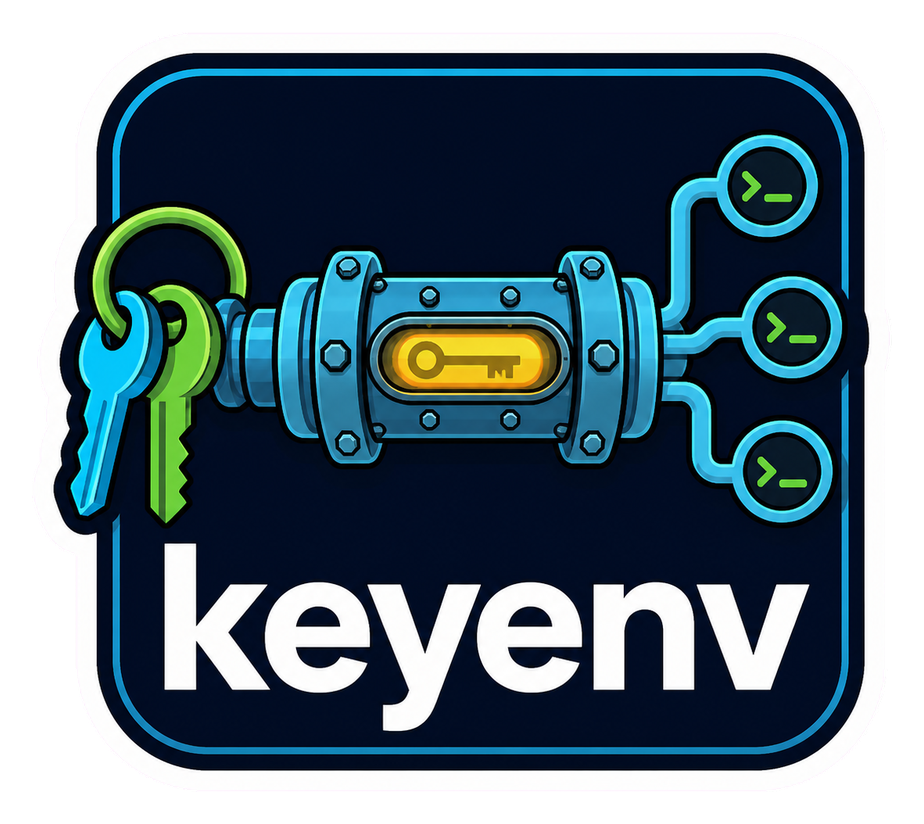

<div align="center">
  

  **🔐 Keep env secrets in Keychain. Inject them on demand. 🔐**
</div>

`keyenv` is a macOS command-line tool for developers who want safer local
credential storage. It keeps values in the login Keychain and injects them only
into commands launched explicitly through `keyenv run`, while applications keep
using their normal environment APIs.

Credential values are never printed or placed in command arguments. Launched
applications and their child processes inherit the resolved environment.

## Install

`keyenv` requires macOS and Python 3.11 or newer.

```bash
uv tool install keyenv-macos
keyenv --help
```

The distribution is named `keyenv-macos`; the installed command is `keyenv`.

## Configure

Add a value-free `.keyenv.toml` to the root of each project:

```toml
[keyenv]
version = 1
# Optional additions to the built-in browser/mobile public-prefix denylist:
public_prefixes = ["MY_CLIENT_PUBLIC_"]

[secrets.OPENROUTER_API_KEY]
account = "my-project/OPENROUTER_API_KEY"
required = true
```

Authorize the account for this canonical project root, store the credential
through the hidden interactive prompt, then check its source:

```bash
keyenv authorize OPENROUTER_API_KEY
keyenv set OPENROUTER_API_KEY
keyenv doctor
```

Commit `.keyenv.toml`, but keep credential values out of it.
Authorization stores only a path digest in Keychain; it never reads the
credential. If the project moves, transfer each account explicitly with
`keyenv authorize --rebind NAME`.

## Commands

Run these from a configured project directory:

```bash
keyenv authorize NAME           # bind one account to this project root
keyenv authorize --rebind NAME  # transfer an existing binding to this root
keyenv set NAME                 # store and verify one declared credential
keyenv doctor                   # report credential names and sources only
keyenv run -- COMMAND [ARGS...] # launch a command with resolved credentials
keyenv migrate                  # copy legacy entries and retain the originals
keyenv migrate --delete-legacy  # delete legacy entries after full verification
keyenv --version                # print the installed version
```

For example:

```bash
keyenv run -- uv run python app.py
keyenv run -- uv run jupyter lab
keyenv run -- pnpm dev
```

`keyenv run` replaces itself with the requested command, so the launched process
owns its signals and exit status. Security or operational failures exit with
status `1`; invalid command-line usage exits with status `2`.

## Notes

- Credentials resolve from a non-empty process environment value, the current
  Keychain service, the legacy Keychain service, and finally missing state, in
  that order. Existing environment values therefore keep CI and provider-native
  injection working.
- Keychain accounts have one authorized project-root owner. Projects that need
  the same underlying value should use distinct account names. A `run` command
  whose declared values all come from the process environment performs no
  Keychain authorization or credential reads for those values.
- `keyenv run` must start inside the manifest project root, and manifest files
  may not be symbolic links.
- The native macOS Keychain backend is required. Configuring another `keyring`
  backend causes operational commands to fail safely.
- `keyenv run` refuses to launch while a declared credential or
  `VERCEL_OIDC_TOKEN` has a populated assignment in a project dotenv file.
- Secret names must be uppercase shell identifiers. Built-in browser and mobile
  public prefixes include `NEXT_PUBLIC_`, `NUXT_PUBLIC_`, `VITE_`, `VUE_APP_`,
  `REACT_APP_`, `GATSBY_`, `EXPO_PUBLIC_`, and `PUBLIC_`. Manifest additions are
  additive and cannot remove these defaults.
- Migration copies and verifies legacy entries under
  `io.github.tsilva.keyenv.v1`. It retains the originals unless
  `--delete-legacy` is supplied and every required entry is safe.
- For linked Vercel projects, use
  `vercel env run -e development -- keyenv run -- COMMAND` instead of
  `vercel env pull`, which writes plaintext files.
- A launched application and its descendants can read injected values. Code
  already running as the same macOS user is outside this protection boundary.
  Report suspected vulnerabilities through [SECURITY.md](SECURITY.md) without
  including credential values.

## Development

```bash
uv sync --locked --all-groups --no-config --exclude-newer "7 days"
uv run --locked ruff check .
uv run --locked ruff format --check .
uv run --locked mypy
uv run --locked python -m unittest discover -s tests -v
KEYENV_INTEGRATION=1 uv run --locked python -m unittest discover -s tests -p 'test_integration_keychain.py' -v
UV_OFFLINE=1 uv build --no-build-isolation --no-sources
uv run --locked python scripts/check_artifacts.py
```

The integration test uses disposable synthetic entries in the login Keychain
and removes them afterward.

## Architecture


## License

[MIT](LICENSE)
